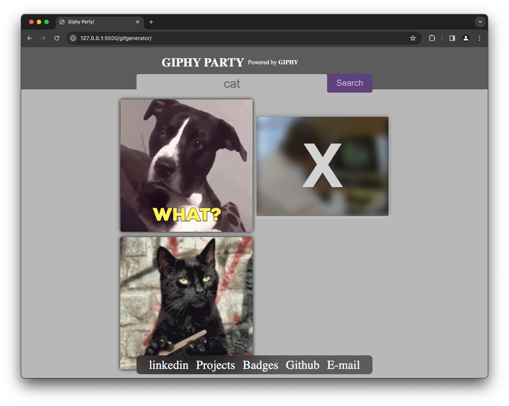

Utilizing an API, this web application allows users to search for GIFs by typing in keywords. Users can easily add their favorite GIFs to their page or delete ones they no longer wish to keep. With a simple interface and dynamic functionality, finding and managing GIFs has never been easier.

HOW TO RUN 
------------------------------------
* To get started, navigate to the Gifgenerator repository on GitHub and download the files. Then, open the folder in Visual Studio Code and launch the live server extension. This action  will automatically open the project in your default web browser.

Click here to view live:
[Visit website]( https://08milam.github.io/gifgenerator/)

TECHNOLOGY STACK USED
------------------------------------
* HTML
* CSS
* JavaScript
* API

